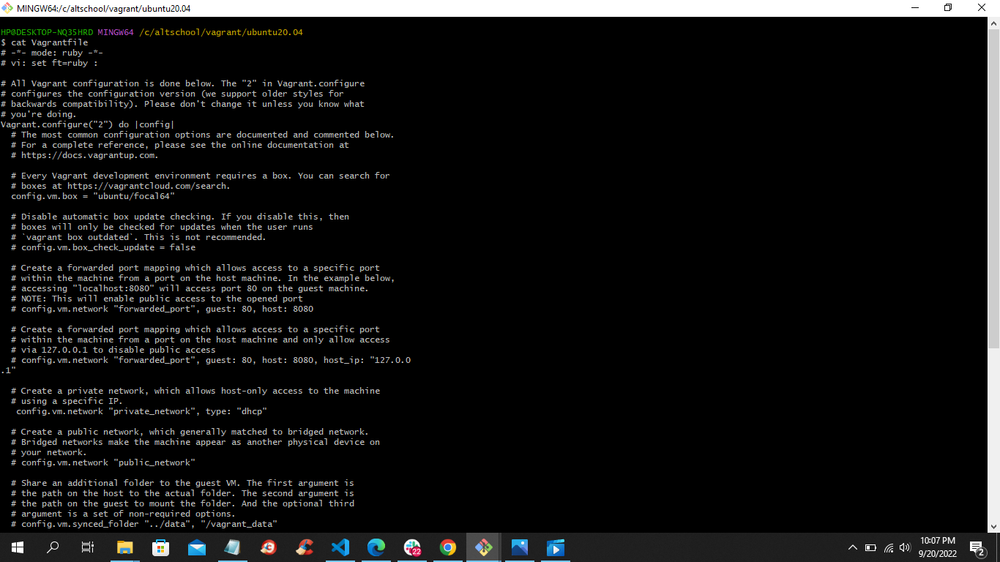
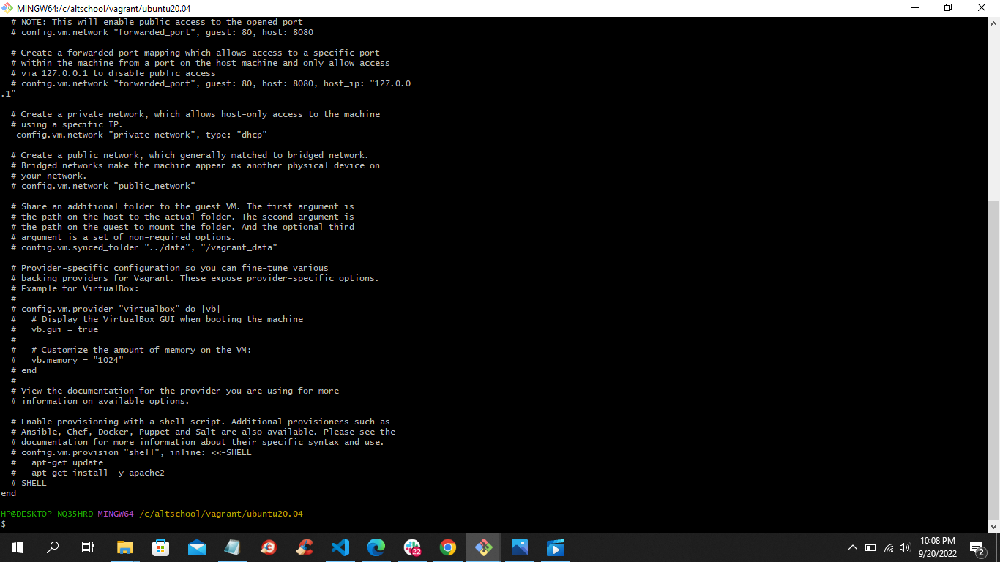
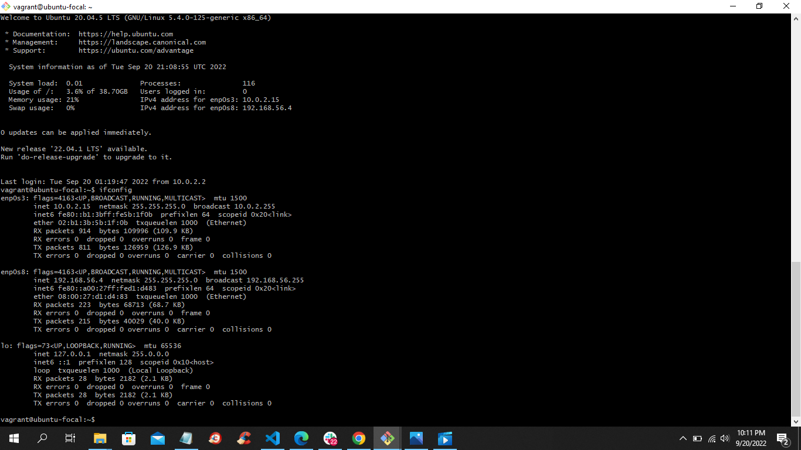

# Exercise 1

<ol>

<li> I created a dedicated vagrant folder for my VM.</li>
<li> I initialized the VM with the vagrant init ubuntu/focal64 command. </li>
<li> I configured the private network in the Vagrantfile (dhcp).</li>
<li> I input the vagrant up command (started the VM).</li>
<li> I input the vagrant ssh command to access/enter the VM.</li>
<li>I installed net tools.</li>
<li> I input the ifconfig command. </li>
</ol>

 

_screenshot of the top of the **cat vagrantfile** command output_

 

_screenshot of the bottom/tail of the **cat vagrantfile** command output_

 

_ifconfig output_
