<ol>

<li>w - displays users that are logged in and what they are currently doing.

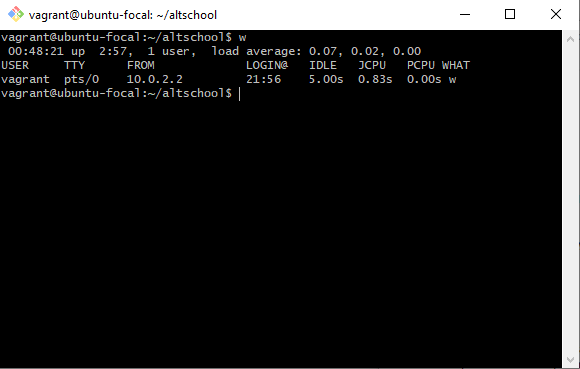</li> 

<li> id - displays the user and group ids of your current user.

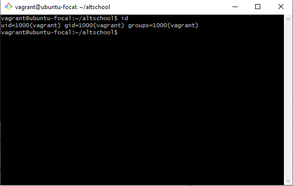
</li> 

<li>cal - displays the calendar.

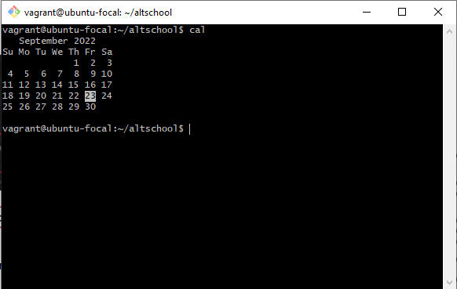</li> 

<li>last reboot - displays system reboot history.

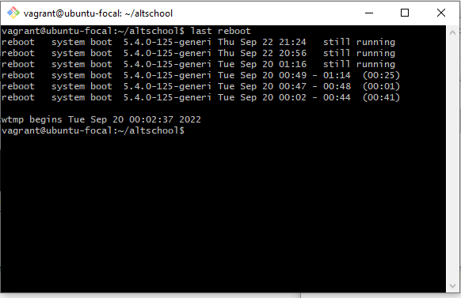</li> 

<li>lsof - lists all open files on the system. (N.B. The list of files was too long so I took a screenshots of the top and the bottom only).

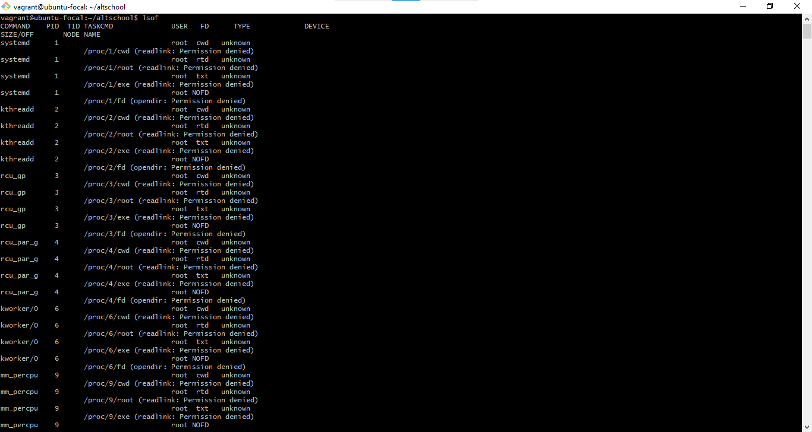
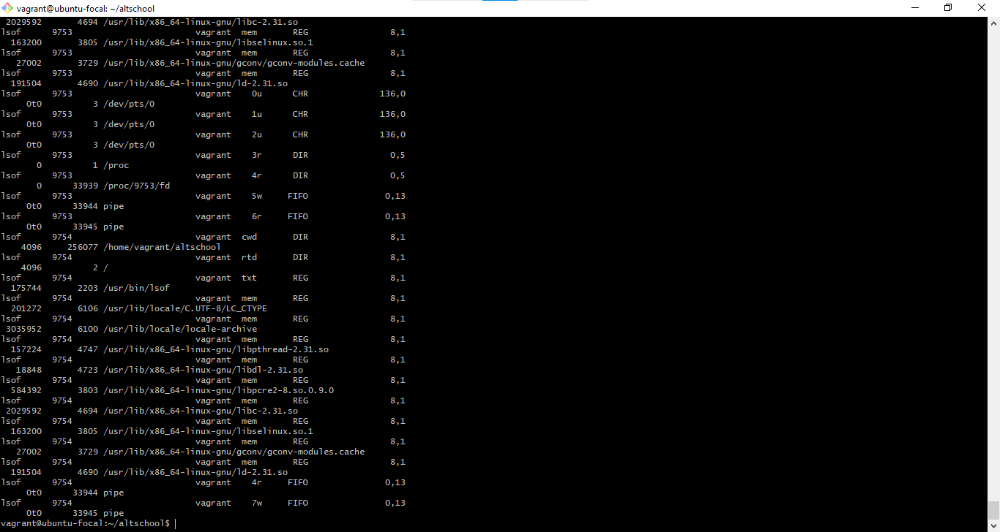</li> 

<li>last - displays the last users who have logged onto the system.

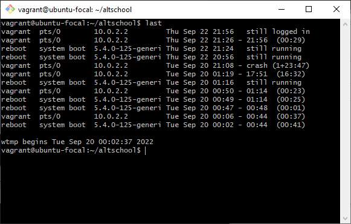</li> 

<li>less <filename> - browses through a text file. (N.B. I typed pwd and ls commands to be sure of where I was and what text file I wanted to browse through, so I selected the one (test2.txt) that I created while following the LMS video before the exercise).

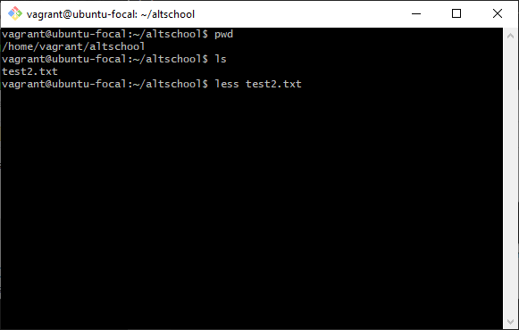
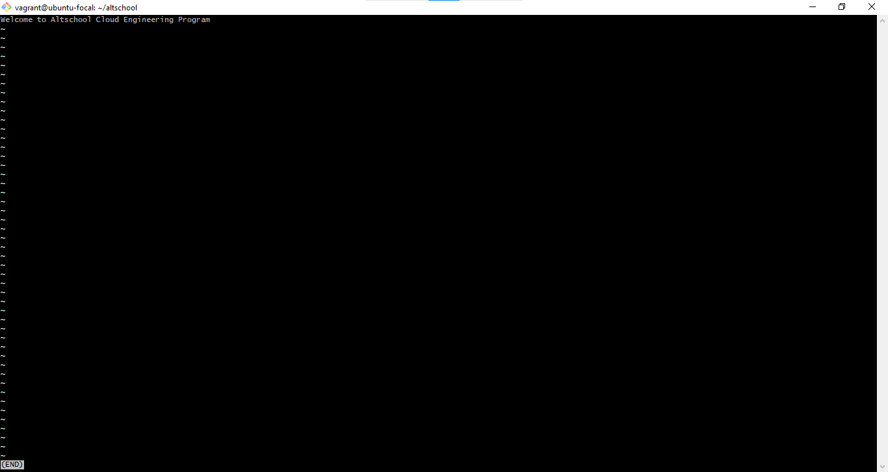</li> 

<li>hostname -I - displays all local IP addresses of the host.

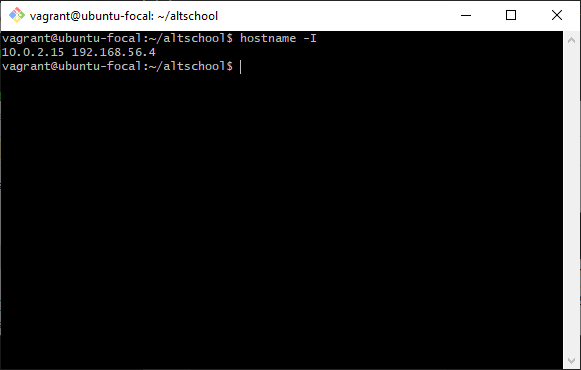</li> 
<li>history - gives a list of all past commands typed in the current terminal session (N.B The history of past commands was too long so i saved screenshots of just the top of the list and the bottom)

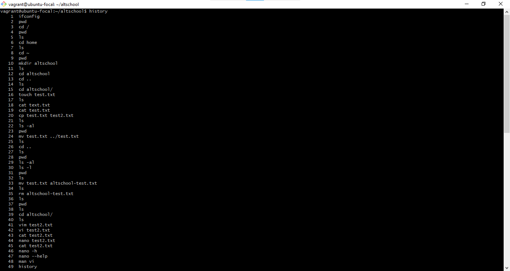
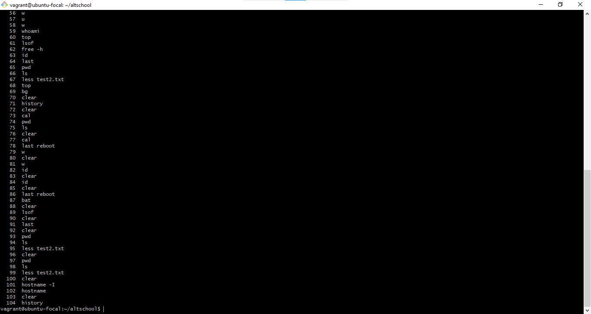</li> 

<li> clear - clears the terminal (N.B. I saved screenshots of the before entering the command and the result after entering the command).

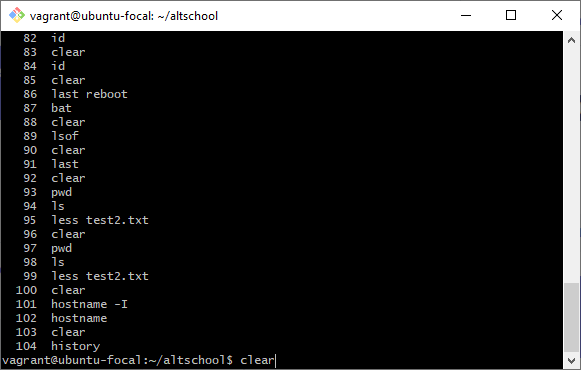
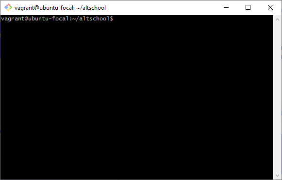
</li> 

</ol>