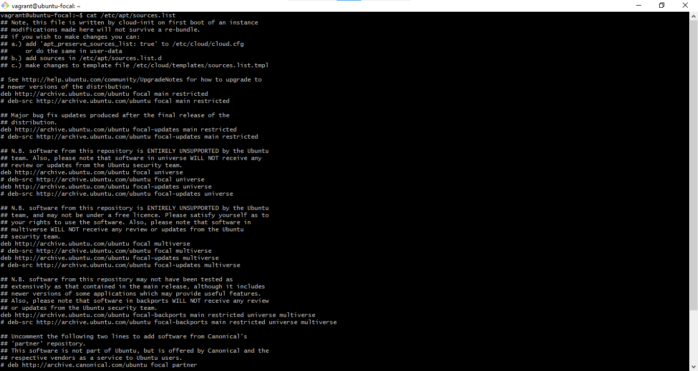
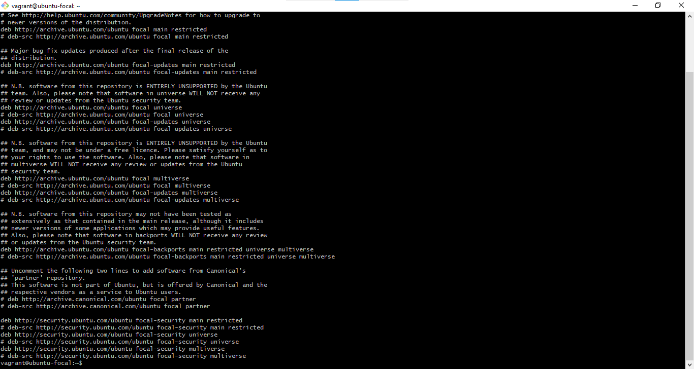
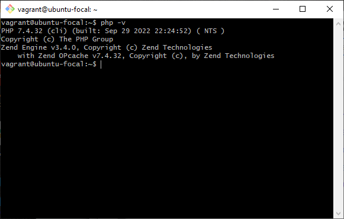

# The content of /etc/apt/sources.list and the output of php -v command.

<ol>
<li> 

**The top view of the content of etc/apt/sources.list**

</li>
 

<li>

**The bottom view of the content of etc/apt/sources.list**

</li>
 

<li>

**The output of the php -v command**

</li>
</ol>