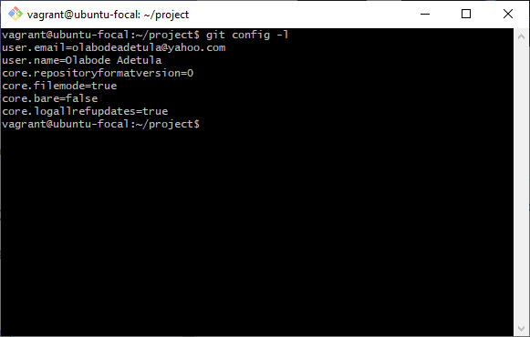
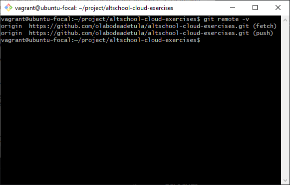
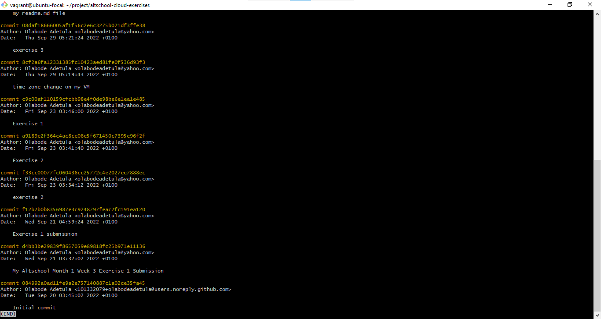
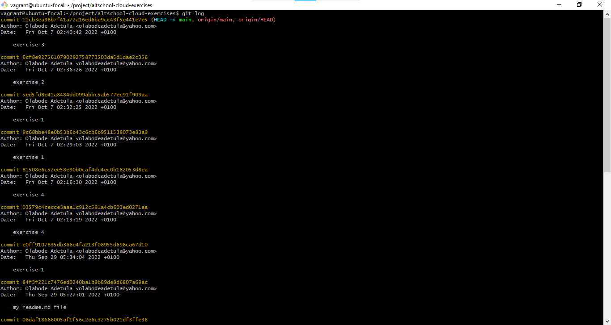

# **The outputs of git config -l, git remote -v and git log**

<ol>
<li>

The output of **git config -l**

</li>
 

<li>

The output of **git remote -v**

</li>
 

<li>

The output of **git log**

_(a)_

_(b)_

</li>
</ol>