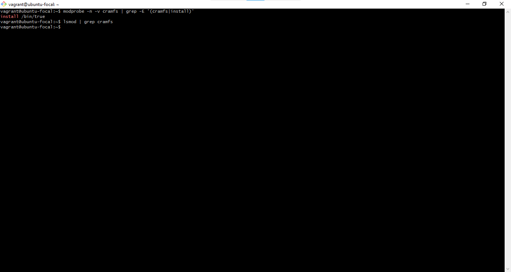
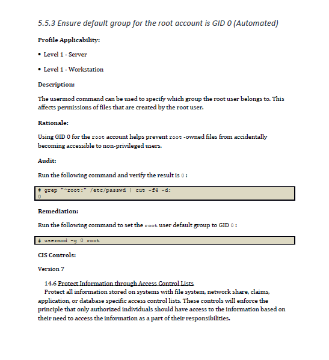
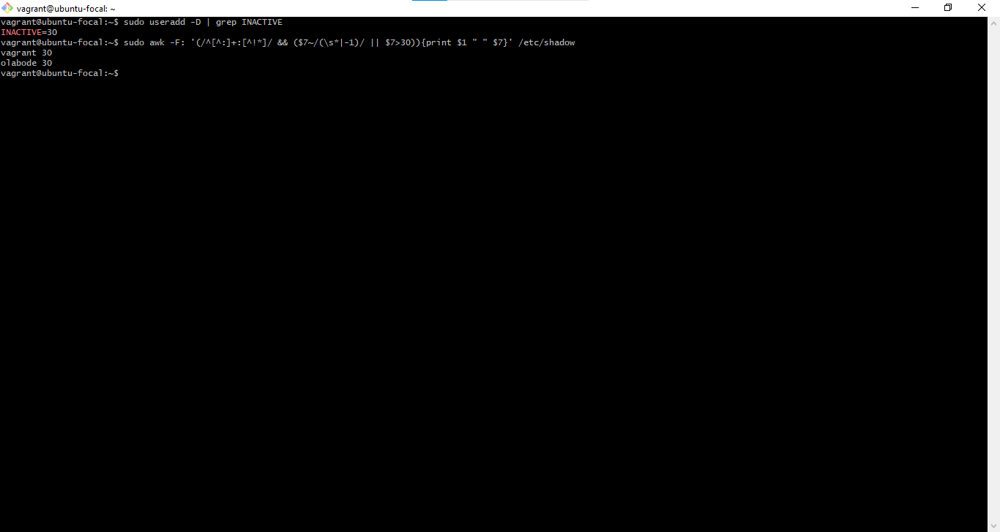
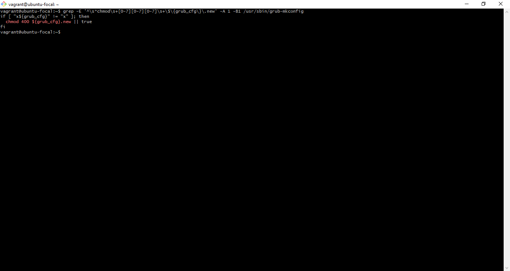

# **Exercise 6 - CIS Benchmarks**

 
<ol>
<li>
Ensure AIDE is installed
 

 

</li>

 

<li>
Ensure AppArmor is installed
 

 

</li>

 

<li>
Ensure AppArmor is enabled in the bootloader configuration
 

 

</li>

 

<li>
Ensure mounting of cramf filesystems is disabled
 

 

</li>

 

<li>
Ensure default group for the root account is GID 0
 

 

</li>

 

<li>
Ensure lockout for failed password attempts is configured
 

 

</li>

 

<li>
Ensure mounting of freevxfs filesystems is disabled
 

 

</li>

 

<li>
Ensure inactive password lock is 30 days or less
 

 

</li>

 

<li>
Ensure all users last password change date is in the past

 

 

</li>

 

<li>
Ensure password expiration is 365 days or less
 

 

</li>

 

<li>
Ensure password hashing algorithm is SHA-512    
 

 

</li>

 

<li>
Ensure permissions on bootloader config are not overridden
 

 

</li>

 

<li>
Ensure system accounts are secured
 

 

</li>

</ol>