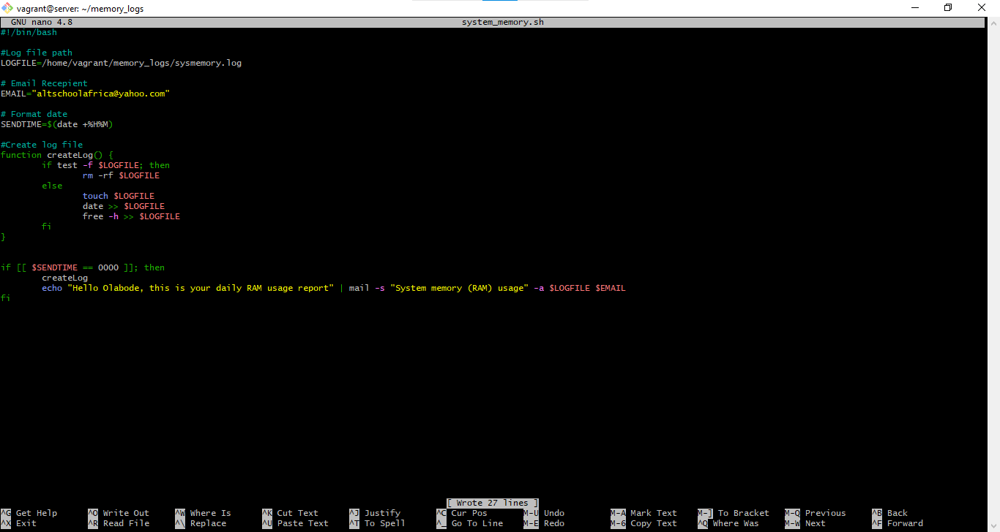
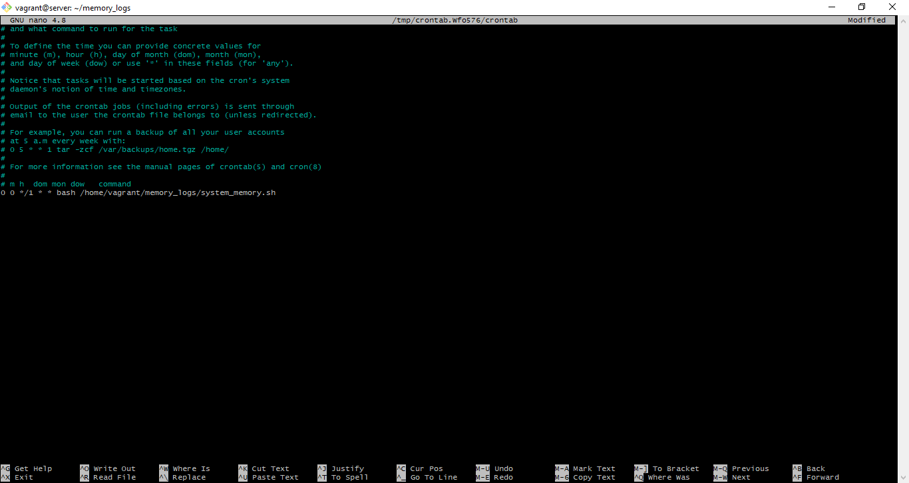
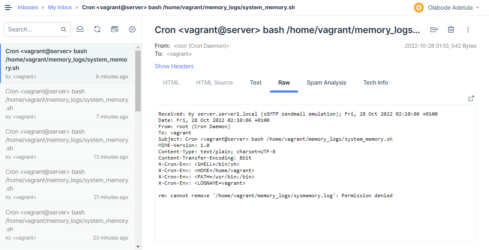

# Exercise 7 - Submit the content of your script, cronjob and a sample of the email sent, all in the folder for this exercise.

 
<ol>
<li>

**Script**
 

</li>

 

<li>

**Crontab**
 

</li>

 

<li>

**Email Sample**
 

</li>

</ol>