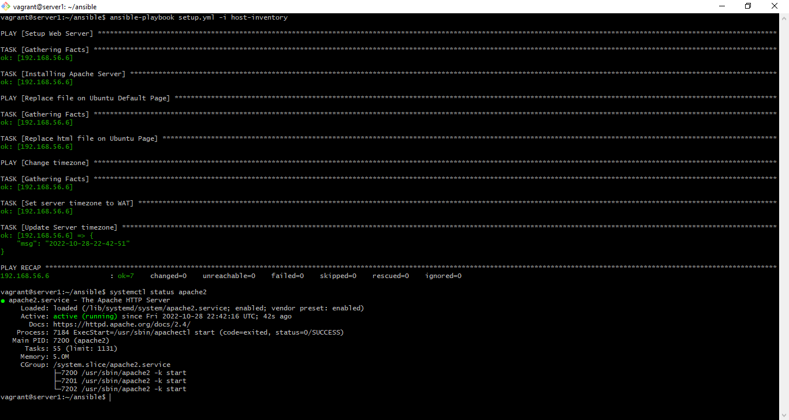
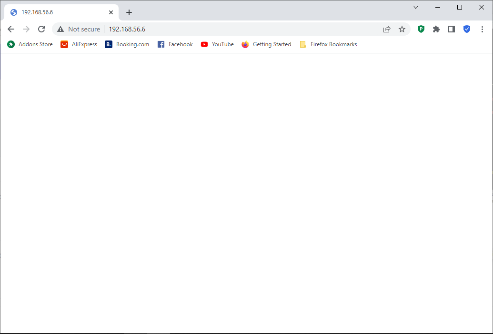

# Instruction: Submit the Ansible playbook, the output of systemctl status apache2 after deploying the playbook and a screenshot of the rendered page.

 
<ol>
<li>

Ansible playbook
 

</li>

 

<li>

The output of systemctl status apache2 after deploying the playbook
 

</li>

<li>
A screenshot of the rendered page.
 

</li>
</ol>